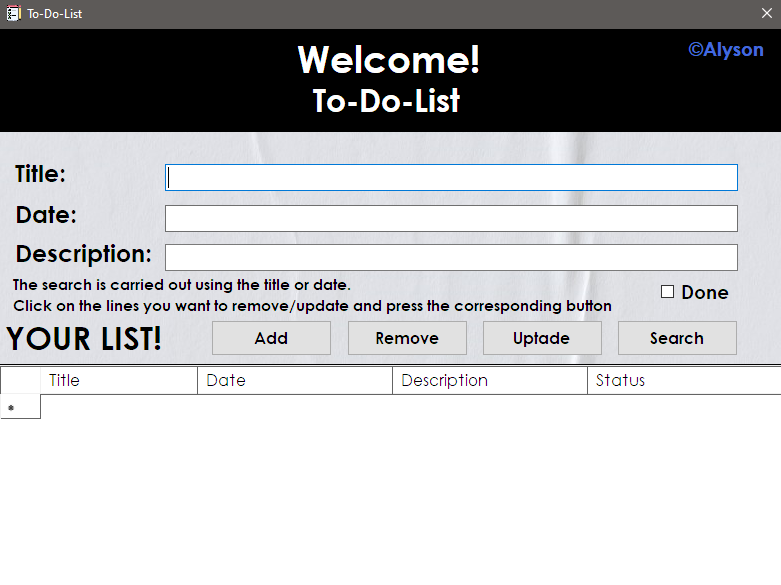
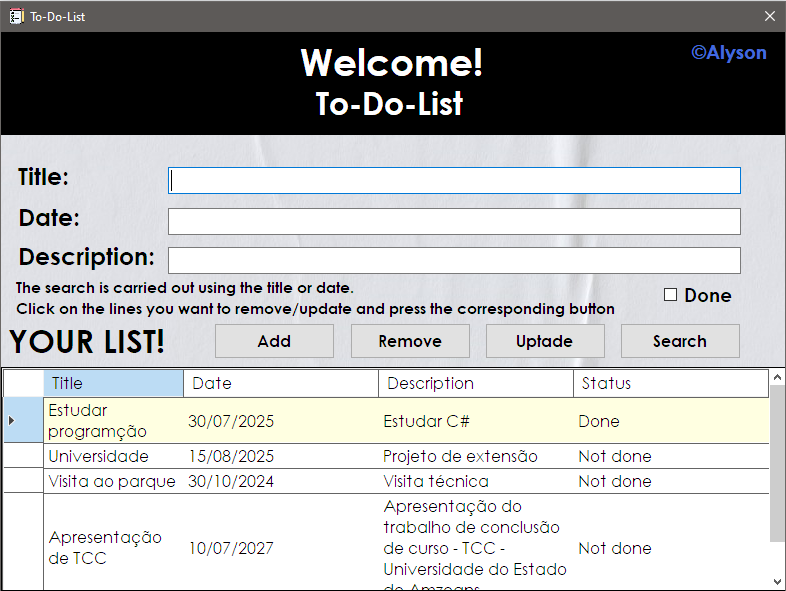

# To-Do List Application

Este é um projeto pessoal de uma aplicação de lista de tarefas (To-Do List) desenvolvida em C# utilizando a plataforma .NET. A aplicação utiliza Windows Forms para a interface gráfica e SQLite como banco de dados, implementando todas as funcionalidades de um CRUD (Create, Read, Update, Delete). O projeto segue princípios de Programação Orientada a Objetos (POO) e boas práticas de desenvolvimento.

## Funcionalidades

- **Adicionar Tarefas**: Interface para inserir novas tarefas, com campos para título e descrição.
- **Visualizar Tarefas**: Lista de tarefas com detalhes como título, descrição e status (pendente/completo).
- **Editar Tarefas**: Funcionalidade para atualizar informações das tarefas existentes.
- **Excluir Tarefas**: Opção para remover tarefas da lista.
- **Buscar Tarefas**: Realizar a busca de alguma tarefa da lista.
- **Persistência de Dados**: Utiliza SQLite para armazenamento e gerenciamento de dados, garantindo a persistência entre sessões.

## Tecnologias Utilizadas

- **C#**: Linguagem de programação utilizada para desenvolver a aplicação.
- **.NET**: Plataforma que fornece o ambiente de desenvolvimento para a aplicação.
- **Windows Forms**: Framework para a criação da interface gráfica do usuário.
- **SQLite**: Banco de dados leve utilizado para armazenar as informações das tarefas.
- **Programação Orientada a Objetos (POO)**: Estrutura do código seguindo princípios de encapsulamento, herança e polimorfismo.
  
## Estrutura do Código

O código é estruturado em classes, promovendo a modularidade e a separação de responsabilidades. As principais classes incluem:

- **Database**: Classe responsável pela incialização e operações com o banco de dados SQLite.
- **Forms**: Classe responsável pela lógica de CRUD.

## Boas Práticas

- **Código Limpo**: O código é escrito de forma clara e legível, facilitando a manutenção e a compreensão.
- **Tratamento de Erros**: Implementação de tratamento de exceções para garantir que a aplicação lida com erros de forma apropriada.
- **Design Responsivo**: A interface é projetada para ser intuitiva e responsiva, proporcionando uma boa experiência ao usuário.

## Imagens do Projeto


*Tela Inicial da Aplicação*


*Tarefas adicionadas*

## Instruções para Execução

1. Clone este repositório em sua máquina local.
   ```bash
   git clone https://github.com/seuusuario/to-do-list.git
2. Abra o projeto no Visual Studio.
3. Compile e execute a aplicação.
